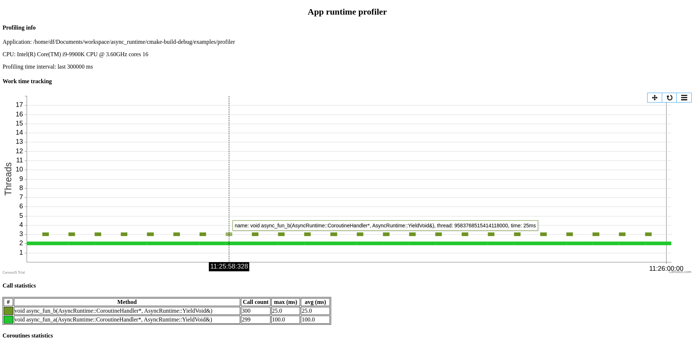

## Async runtime library

[](https://github.com/fdimushka/async_runtime/actions/workflows/build.yml)

AR - it is a C++ library for efficient execution asynchronous tasks, io network operations and parallel heterogeneous computing. 

#### Threads & coroutines & scheduler
Runtime uses efficient work-stealing scheduler to optimize your multithreaded performance and trying to reduce CPU IO wait.
Used asymmetric coroutines based on context switcher implemented in [Boost.Context](https://github.com/boostorg/context).

[Learn more...](docs/arch.md)


## Documentation
* [Usage examples](docs/usage.md)
* [Reference section - all the details](docs/readme.md)


## Build instructions
To build you will need:

* cmake >= 3.12.4
* gcc >= 4.6
* libuv >= 1.44.1
* doxygen >= 1.9.3 (optional)
* google benchmark >= v1.6.1 (optional)

```
mkdir build
cd cmake ..
make 
make install
``` 

CMake option:

| Option            | Description                       | Default  |
| :---              |    :----:                         | :----:   |
| `WITH_PROFILER`   | build with trace profiler         | ON       |
| `WITH_TESTS`      | build with unittests              | OFF      |
| `WITH_BENCHMARKS` | build with benchmarks             | OFF      |
| `WITH_EXAMPLES`   | build with samples                | ON       |
| `WITH_DOCS`       | build with docs                   | OFF      |

## Benchmarks
Run on Intel(R) Core(TM) i9-9900K CPU @ 3.60GHz
CPU Caches:
- L1 Data 32 KiB (x8)
- L1 Instruction 32 KiB (x8)
- L2 Unified 256 KiB (x8)
- L3 Unified 16384 KiB (x1)
  Load Average: 1.03, 0.98, 0.87

|Benchmark            |         Time       |      CPU  | Iterations|
| :---                |    :----:          | :----:    | :----:    |
|context switch       |       183 ns       |   183 ns  |    3770529|
|concurrent task_call |      3850 ns       | 0.004 ns  |    1000000|
|await empty task     |      6428 ns       |  4069 ns  |     173605|


## Profiler and tracing tool
Inner profilers allows you to get the following information:
* System info.
* Async functions work time tracking peer threads.
* Info of functions call.
* Info of threads.
* Coroutines count.



For build library with profiler use `cmake` option `-DWITH_PROFILER=ON`.
For more details see [this page](docs/profiling.md).