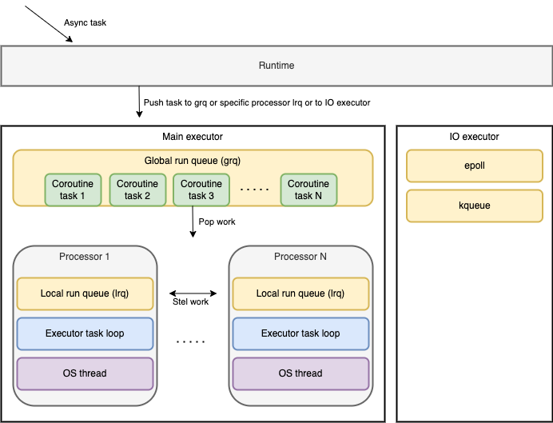

## Scheduling concept

Base primitives hierarchy

* Runtime - is a interaction interface, depending on the task chooses executor
  and post task to executor (main executor, io executor, or user executor.). 
* Main executor - task execution environment, contains processors and global run queue (grq).
* Processor - is a logical processor for every virtual core that is identified on the host machine. 
  Processor contains local run queue (lrq) and execution loop, execution loop does the following:
   - Only 1/61 of the time, check the global runnable queue for a task.
   - if not found, check the local queue.
   - if not found, try to steal from other Processor.
   - if not, check the global runnable queue.

